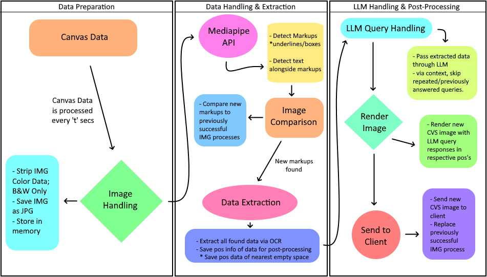

# 📓 Noted
<<<<<<< HEAD
=======

## 📌 Overview
Noted is an intelligent web-based notebook that enables students to write alongside a smart AI-powered assistant. Noted is still in early development and has many exciting plans ahead.

Noted aims to ease any student's experience by giving them more than just another stylus-based note-taking app. By adopting LLMs and other forms of AI/ML to work alongside the student, it aims to boost productivity while still giving the user space to think and work for themselves. Noted also seeks to provide users with a more friendly UX, with simple and easy to comprehend menus, as well as a visually pleasing and dynamic UI.

## 🎯 Key Features

- ❌ **Cross-platform Compatibility:** Noted will be available across multiple platforms such as Mac/iOS, Android, Windows, and Linux.
- ❌ **Intelligent AI assistant:** Marking text, such as underlining, boxing, etc, will activate LLM use.
- ❌ **Social Circles:** Users can join their specified classes and share notes among peers without the need for direct communication.
- ❌ **Flash Cards:** Users can use their created notes to create flash cards and test.
- ❌ **Second Window:** Users can open a pop-up *in-browser* window that allows them to view external powerpoints/websites.

## 🚧 Pipeline
  
Noted utilizes Mediapipe's CV capabilities to detect and differentiate between various markups that the user creates. The system is built upon a three-stage setup, with the first stage being data preparation, the second being CV handling and data extraction, and finally, the third being LLM query and post-processing. To prevent constant API calls to the LLM, during the second stage of the pipeline, the data is checked and compared to previously successful processes to check for any differences in markups. During the third stage, the LLM skips any repeated queries to prevent unnecessary API calls.

## 💽 Tech Stack

*Client:* 
- NextTS

*API:*
- FastAPI

*Database:*
- PostGreSQL

>>>>>>> b8a8c4b7f1a9eaedf5a7c797031683109ded69e8

## 📌 Overview

Noted is an intelligent web-based notebook that enables students to write alongside a smart AI-powered assistant. Noted is still in early development and has many exciting plans ahead.

Noted aims to ease any student's experience by giving them more than just another stylus-based note-taking app. By adopting LLMs and other forms of AI/ML to work alongside the student, it aims to boost productivity while still giving the user space to think and work for themselves. Noted also seeks to provide users with a more friendly UX, with simple and easy to comprehend menus, as well as a visually pleasing and dynamic UI.

## 🎯 Key Features

- ❌ **Cross-platform Compatibility:** Noted will be available across multiple platforms such as Mac/iOS, Android, Windows, and Linux.
- ❌ **Intelligent AI assistant:** Marking text, such as underlining, boxing, etc, will activate LLM use.
- ❌ **Social Circles:** Users can join their specified classes and share notes among peers without the need for direct communication.
- ❌ **Flash Cards:** Users can use their created notes to create flash cards and test.
- ❌ **Second Window:** Users can open a pop-up _in-browser_ window that allows them to view external powerpoints/websites.

## 🚧 Pipeline

  
Noted utilizes Mediapipe's CV capabilities to detect and differentiate between various markups that the user creates. The system is built upon a three-stage setup, with the first stage being data preparation, the second being CV handling and data extraction, and finally, the third being LLM query and post-processing. To prevent constant API calls to the LLM, during the second stage of the pipeline, the data is checked and compared to previously successful processes to check for any differences in markups. During the third stage, the LLM skips any repeated queries to prevent unnecessary API calls.

## 💽 Tech Stack

_Client:_

- NextTS

_API:_

- FastAPI

_Database:_

- PostGreSQL
